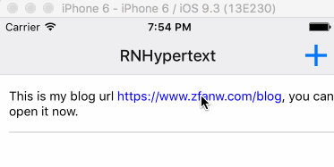

# React native hypertext

1. You have urls (http or https) in plain texts
2. You want to open them in browser apps

Then you can use `RNHypertext` in place of `Text` component from react-native. Or you should just use `Text`.

## Usage

```
import RNHypertext from 'rn-hypertext'
import React from 'react'
import { View } from 'react-native'
export default class extends React.Component {
  render () {
    return <View><RNHypertext>this is my blog url https://www.zfanw.com/blog, you can open it now.</RNHypertext></View>
  }
}
```

## Props

You can customize link style with `linkStyle` prop:

```
<RNHypertext linkStyle={{
  color: 'red',
  fontSize: 20
}}>test</RNHypertext>
```

## screenshot

